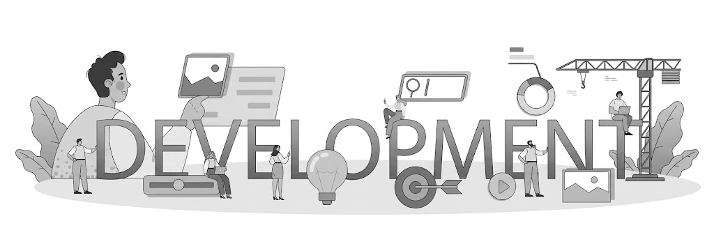

<h1 align="center">Hi 👋, I'm Amrit Raj</h1>

<h3 align="center">
🚀 MERN Stack Developer | 🎮 JavaScript Game Developer
</h3>

---

# 🧠 About Me

<table>
<tr>
<td width="55%">

- 🚀 **MERN Stack Developer** focused on building modern web applications  
- 🌐 Strong in **Frontend Development (HTML, CSS, JavaScript)**  
- 🎮 Building **browser-based games using JavaScript & Canvas**  
- 🧩 Creating **interactive websites and full-stack applications**  
- 📚 Currently learning **Node.js, Express & MongoDB**  
- 🎯 Goal: **Become a Professional Full Stack Developer**

</td>

<td width="45%">

</td>
</tr>
</table>

---
# 🛠️ Tech Stack

### 🌐 Web Development

&nbsp;&nbsp;&nbsp;
&nbsp;&nbsp;&nbsp;
&nbsp;&nbsp;&nbsp;
&nbsp;&nbsp;&nbsp;
&nbsp;&nbsp;&nbsp;
&nbsp;&nbsp;&nbsp;

---

### ⚙️ Tools

&nbsp;&nbsp;&nbsp;
&nbsp;&nbsp;&nbsp;
&nbsp;&nbsp;&nbsp;
&nbsp;&nbsp;&nbsp;

---

# 🌐 Skills

- Responsive UI Design  
- DOM Manipulation  
- JavaScript Logic  
- REST API Integration  
- Component-Based UI  
- Full Stack Development (Learning)  

---

# 📈 GitHub Analytics Dashboard

---

# 📊 Languages & Contributions

---

# 🏆 Achievements

---

# 🐍 Contribution Snake

---

# ⚡ Advanced Metrics

---

# 📫 Connect With Me

---

# 🚀 Quote

⭐ *"Consistency + Projects = Success"*

---
